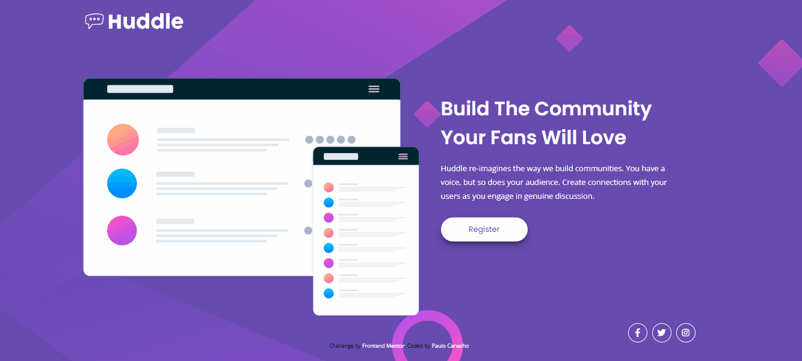
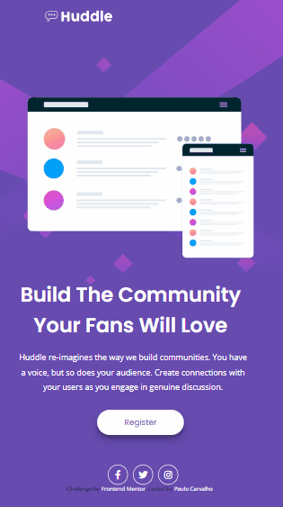

# Frontend Mentor - Huddle landing page with single introductory section solution

#### Huddle landing page with single introductory section é um desafio do Frontend Mentor feito com HTML e CSS. Esse projeto, apresar de ser uma landing page simples, traz elementos bem interessantes nessas linguagens. Obrigado por chegar até aqui. Confira o código. ####

## Índice

- [Captura de tela](#captura-de-tela)
- [Links](#links)
- [Construído com](#construído-com)
- [O que aprendi](#o-que-aprendi)
- [Desenvolvimento contínuo](#desenvolvimento-contínuo)
- [Recursos úteis](#recursos-úteis)
- [Paulo Carvalho](#autor)

### Captura de tela

#### Tela Desktop



#### Tela Mobile



### Links

- Site URL: ``` https://paulo1310.github.io/huddle-landing-page/ ```

### Construído com

<div style="display: inline_block"><br>
  
         
</div>

### O que aprendi

Nesse projeto envolvendo HTML e CSS, aprendi conceitos importantes. Através do CSS, aprendi a dar estilo e formatar elementos HTML, explorando propriedades como cores, fontes, posicionamento e responsividade. No processo de aprendizado, foi importante entender os conceitos fundamentais de cada linguagem. Praticar esses conceitos em projetos reais nos ajuda a aprimorar nossas habilidades e explorar diferentes técnicas e soluções para os desafios que encontramos.

## Trechos de códigos

```css
footer .social-media {
  display: flex;
  justify-content: flex-end;
  margin-top: 5px;
  margin-right: 50px;
}

footer .social-media a i{
  color: white;
  font-size: 18px;
  width: 40px;
  height: 40px;
  border: 1px solid white;
  border-radius: 50%;
  display: flex;
  align-items: center;
  justify-content: center;
  margin-left: 10px;
}

footer .social-media a i:hover {
  color: var(--soft-magenta);
  transition: .2s ease-in-out;
  border: 1px solid var(--soft-magenta);
}
```

### Desenvolvimento contínuo

Pretendo continuar focado em construir um conhecimento sólido nessas limguagens. Ainda há muitos conceitos importantes para serem desenvolvidos. Todos os dias são gradativamente adicionados ao meu repertório de ferramentas.

### Recursos úteis

- [Dev em Dobro](https://www.youtube.com/@DevemDobro) - Este é um canal onde encontro muito material. Tem muito conteúdo relacionado ao desenvolvimento. Recomendo a todos que querem aprender sobre esse e outros conceitos relacionados.

## Autor

[Paulo Carvalho](https://www.linkedin.com/in/paulocarvalho13/)